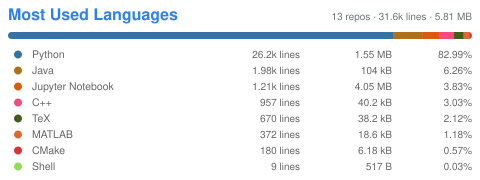

### 👋Hi, this is Wavelix.

- Master's Student in Control Science and Engineering @[AiM](https://sdim.sustech.edu.cn/), [SUSTech](https://www.sustech.edu.cn/en/)
- B.Eng. in Automation @[AiM](https://sdim.sustech.edu.cn/), [SUSTech](https://www.sustech.edu.cn/en/)

  <picture>
    <source media="(prefers-color-scheme: dark)" srcset="./lang-loc-dark.svg">
    
  </picture>

